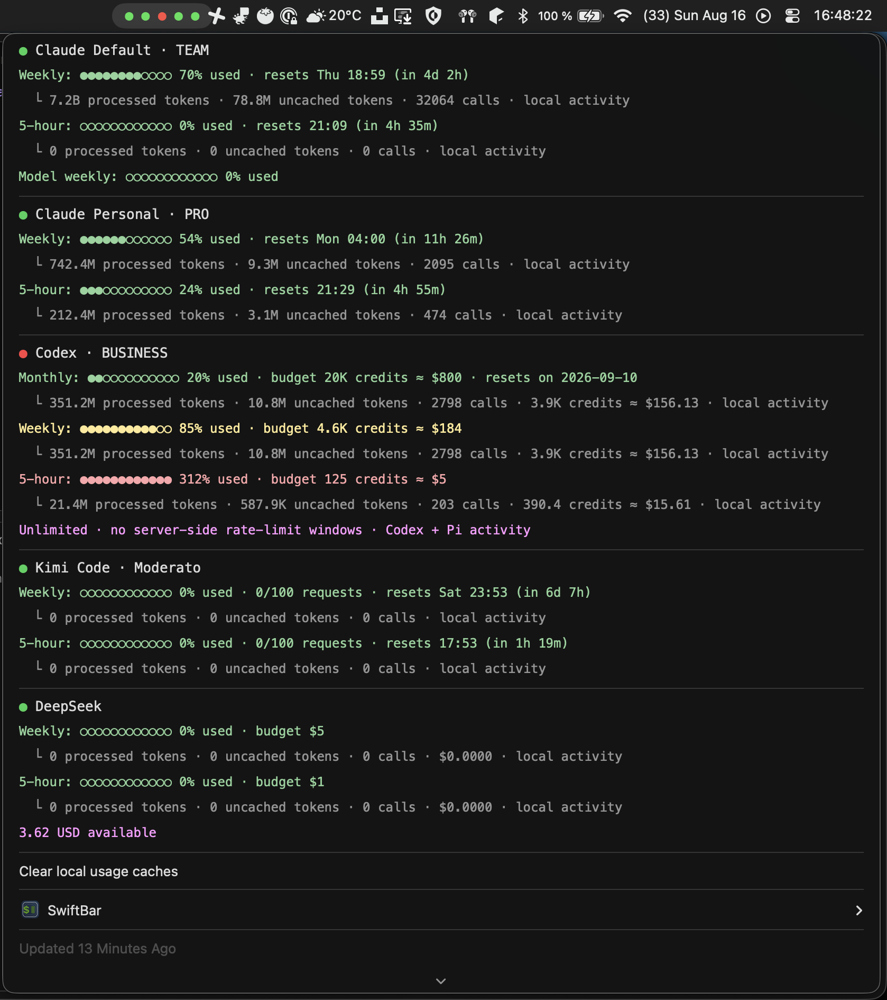

# SwiftBar plugins

My [SwiftBar](https://github.com/swiftbar/SwiftBar) plugins, in Python, sharing
one small toolkit.

```
lib/swiftbar/     the toolkit every plugin shares
plugins/          one file per plugin, plus agent_usage/ for the one that outgrew a file
tests/            offline test suite
```

Each plugin documents itself. Open the file to see what it shows, what you can
configure and where its data comes from — there is no per-plugin documentation
anywhere else.

| Plugin | Shows |
| --- | --- |
| `agent-usage.15m.py` | Coding agent subscription quotas and local spend |
| `goldenhour.1h.py` | This evening's golden hour |
| `hn.1h.py` | Hacker News posts over a score threshold, with notifications |
| `kubecontext.1m.py` | Active kubeconfig context, and a menu to switch |
| `pollen.1h.py` | Pollen levels for a Swedish city |
| `soltid.1h.py` | How long you can stay in the sun before burning |
| `spotifyvolume.5m.py` | Read and set Spotify's volume |



## Install

```bash
make install
```

That symlinks every plugin into `~/swiftbar`, so an edit here takes effect on
the next SwiftBar refresh with nothing to rebuild. Override the destination
with `make install PLUGIN_DIR="$HOME/Library/Application Support/SwiftBar/Plugins"`.

`make uninstall` removes the symlinks. `make list` prints what would be
installed. A plugin's refresh interval is the `15m` / `1h` part of its
filename, so renaming the file changes it.

## Running them

Plugins are stdlib-only and carry [PEP 723](https://peps.python.org/pep-0723/)
metadata in the shebang:

```python
#!/usr/bin/env -S /opt/homebrew/bin/uv run --script --quiet
# /// script
# requires-python = ">=3.12"
# ///
```

uv provisions and caches its own interpreter, which matters because SwiftBar
launches plugins from a GUI context: `PATH` is the launchd minimum, so a
version manager's shim is invisible and `/usr/bin/python3` is whatever macOS
shipped — 3.9 on current systems. Pinning here means the Python that runs a
plugin is the Python it was written against. uv is referenced by absolute path
for the same reason.

There is no virtualenv and nothing to install: the toolkit is found by putting
`lib/` on `sys.path`, because Python only adds a script's own directory. A uv
path dependency would be tidier, but uv resolves those against the working
directory, which SwiftBar does not control.

## The toolkit

```python
from swiftbar import Menu, run

def build(menu: Menu) -> None:
    menu.title("Hello")
    row = menu.item("A row", href="https://example.com")
    row.item("Nested", refresh=True)

raise SystemExit(run(build, name="Example"))
```

| Module | For |
| --- | --- |
| `output` | Menu rows, submenus, attribute escaping |
| `plugin` | The entrypoint wrapper: a crash becomes an error row, not a stack trace |
| `http` | JSON/text with timeouts, parallel fetches, graceful failures |
| `state` | Small JSON state files, written atomically |
| `shell` | Finding and running binaries despite SwiftBar's minimal `PATH` |
| `notify` | macOS notifications, with AppleScript quoting handled |
| `ansi` | Semantic colours for menu rows |
| `meters` | Progress bars and compact number formatting |
| `dates` | Parsing the timestamp shapes APIs return |

Escaping is the reason this exists: SwiftBar splits a row on its first `|`, so
any title containing one silently truncates unless it is escaped. `Menu` does
that everywhere.

## Adding a plugin

Copy the shebang block from an existing plugin, write a module docstring that
documents it, build a `Menu`, and put the configuration in the `run(...)` call
at the bottom so it is visible in one place. Name the file
`<name>.<interval>.py` and run `make install`.

## Development

```bash
make test     # offline suite
make check    # lint, then run every plugin as SwiftBar would
make fmt      # format and autofix
```

`make test-live` hits every agent provider's real API and needs you logged in.
